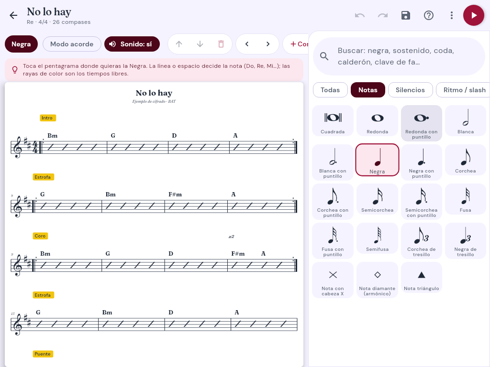
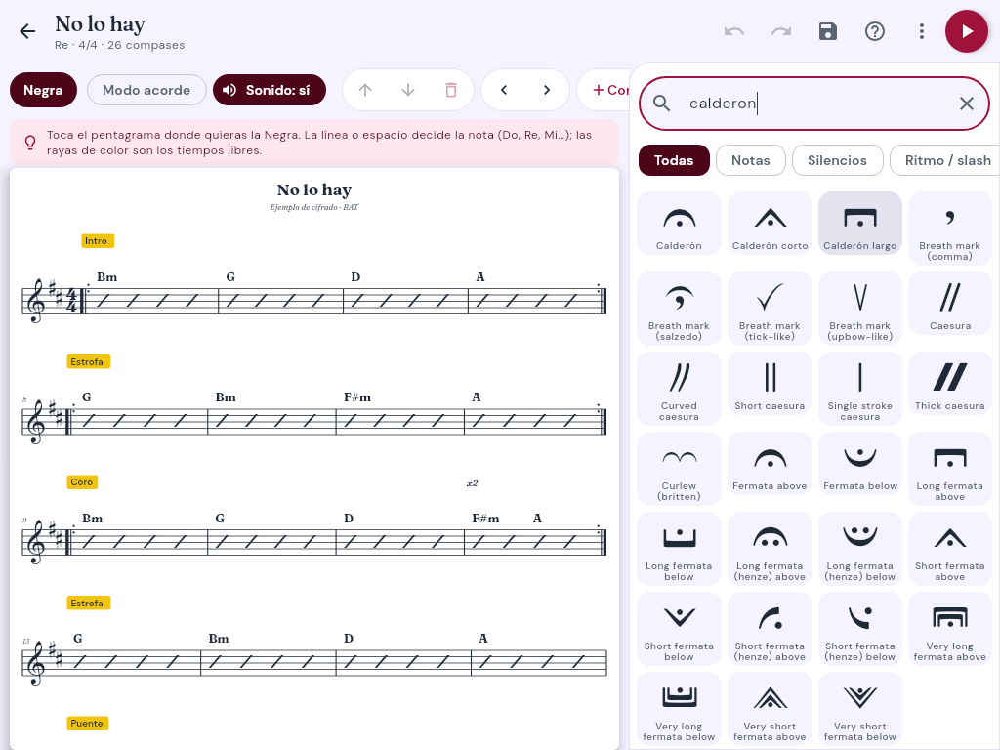
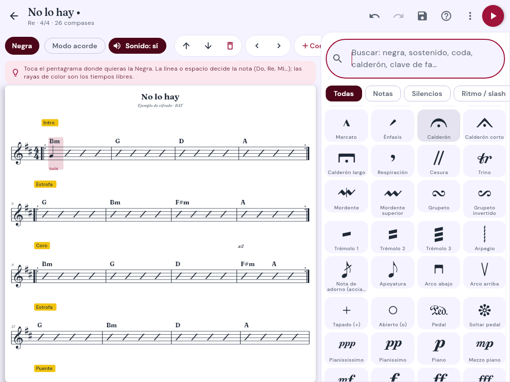
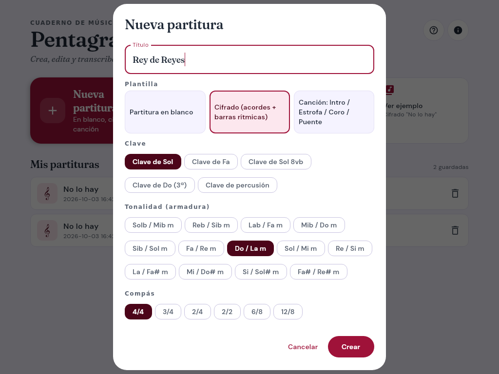
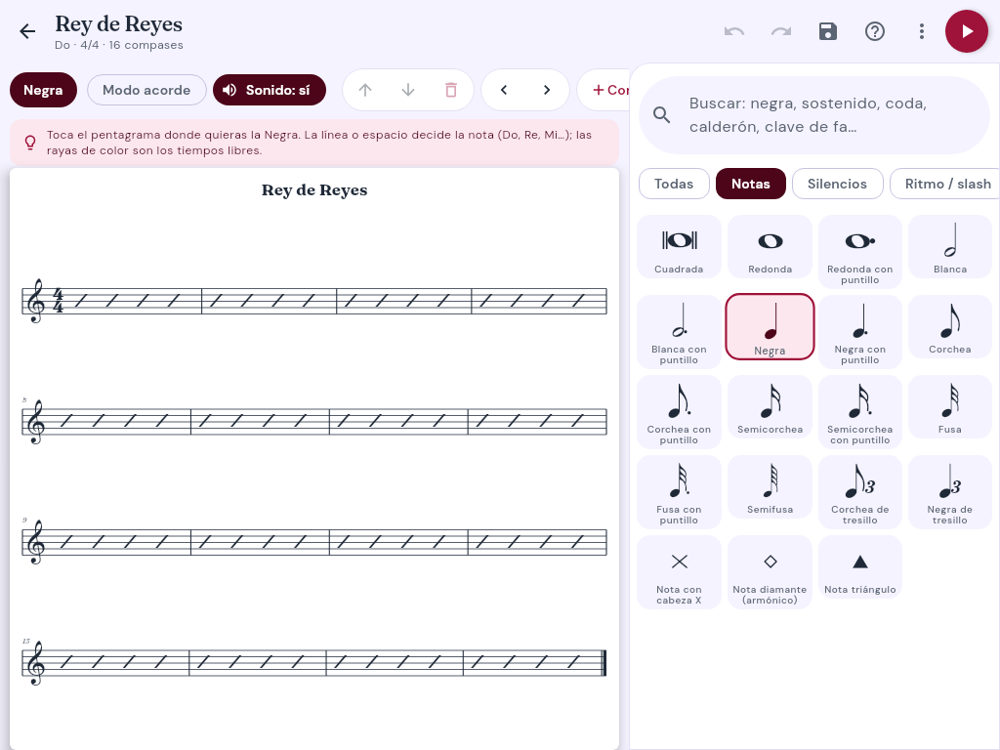
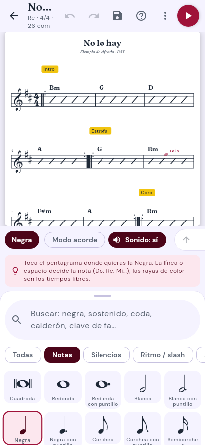
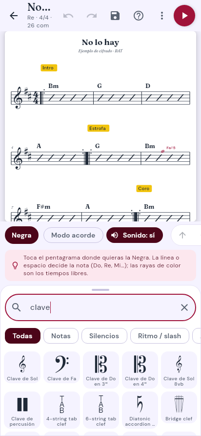
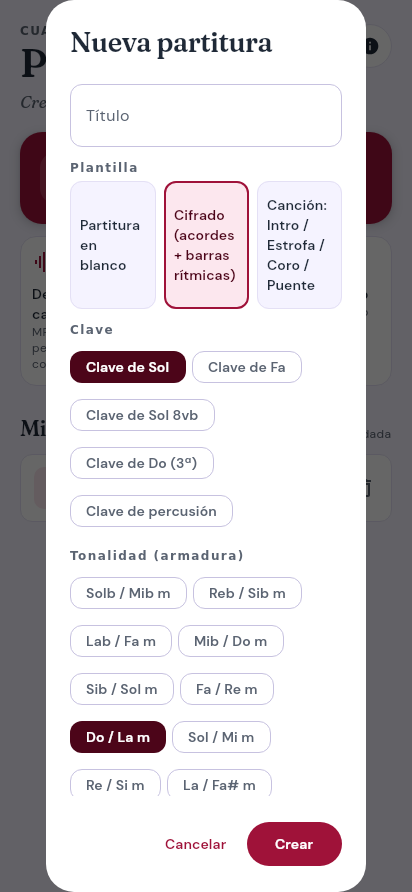
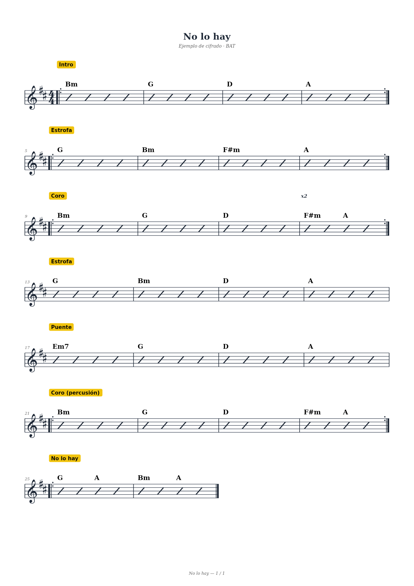

# Capturas de la app

Generadas automáticamente por las pruebas del commit 1ac8d04.

### 01_inicio.png

### 02_editor_ejemplo.png

### 03_busqueda_calderon.png

### 04_nota_colocada.png

### 05_biblioteca_con_partitura.png

### 06_dialogo_nueva_0.png

### 06_dialogo_nueva_1.png

### 07_partitura_nueva.png

### movil_1_inicio.png

### movil_2_editor.png

### movil_3_buscador.png

### movil_4_nueva_partitura_0.png

### movil_4_nueva_partitura_1.png

### pdf_pagina_1.png

## Pruebas de rendimiento

| Prueba | Resultado | Límite |
|---|---|---|
| Memoria de 1 min de audio decodificado | 5.0 MB (máx. 15 min ≈ 76 MB) | < 6 MB/min |
| Pentagrama completo (todos los sonidos) de canción de 3 min | 904 ms (199× tiempo real, 1614 notas) | < 30 000 ms |
| Guardar partitura de 1 000 compases (JSON) | 23 ms, 814 KB | < 1 000 ms |
| Abrir partitura de 1 000 compases (JSON) | 61 ms | < 1 500 ms |
| Exportar MusicXML de 1 000 compases | 36 ms, 1078 KB | < 1 500 ms |
| Transcribir canción de 3 min (melodía + acordes) | 1606 ms (112× tiempo real) | < 30 000 ms |
| Cargar catálogo de 2928 figuras SMuFL | 7 ms | < 500 ms |
| Búsqueda de figuras (por consulta, 3088 figuras) | 1.6 ms | < 50 ms |
| Acomodar partitura de 500 compases / 4 000 notas | 7 ms (500 líneas) | < 300 ms |
| 1 000 toques sobre el pentagrama (hit test) | 8 ms | < 200 ms |
| Preparar el sonido de una nota al escribirla | 0.79 ms | < 20 ms |
| Preparar el sonido de una acorde al escribirla | 0.95 ms | < 20 ms |
| Preparar el sonido de una barra rítmica sin acorde al escribirla | 0.20 ms | < 20 ms |
| Sintetizar 150 compases (5 min 0 s) antes de ▶ | 457 ms | < 2 000 ms |
| ▶ desde el último compás | 3 ms | < 100 ms |
